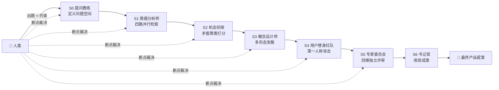

<div align="center">

# 🤖 AI-Native Product Workflow

### 对抗式多 Agent 产品定义工作流

**不是单轮对话，而是「信息生产 → 对抗验证 → 人类裁决」的循环**


[为什么需要它](#为什么) · [工作流架构](#工作流架构) · [核心机制](#核心机制) · [快速开始](#快速开始) · [演示案例](#演示案例)

</div>

---

用 LangGraph 实现的**六阶段 × 七角色**对抗式多 Agent 系统，把传统"拍脑袋立项"改造为可复用的 AI 原生流程：市场情报 → 机会挖掘 → 概念发散 → 红队对抗 → 可行性评审 → 收敛成案。支持人类断点介入、记忆隔离与证据链追溯。

> 好方案不是被赞同出来的，而是在连续攻击下仍站得住的方案。

## 为什么

传统 AI 辅助产品定义的三大病灶：

| 病灶 | 表现 | 本框架的对策 |
|---|---|---|
| **AI 说服 AI** | 多轮对话中越聊越自信，同温层效应 | 记忆隔离：每个 Agent 只看上游结构化产出，不看中间推理 |
| **事实与推测混杂** | 生成内容无法区分信源数据与模型臆测 | 证据链：`Fact` 与 `Inference` 强制分离，推测必须带置信度 |
| **只有赞同没有攻击** | 概念一路绿灯，上线后暴雷 | 红队对抗：数据驱动的用户替身第一人称攻击，攻击无回应则概念 kill |

## 工作流架构



### 角色分工与记忆隔离

| 阶段 | 角色 | 职责边界 | 记忆隔离规则 |
|---|---|---|---|
| S0 | 提问教练 | 定义问题空间、边界条件 | 只读系统提示 |
| S1 | 情报分析师 | 四路并行检索、交叉验证 | 只输出情报地图 |
| S2 | 机会侦探 | 矛盾聚类、量化打分 | 只读 S1 输出 |
| S3 | 概念设计师 | 多形态发散、禁止收敛 | 只读 S2 输出 |
| S4 | 用户替身/红队 | 第一人称攻击概念 | 只读 S3 输出 |
| S5 | 专家委员会 | 技术/供应链/合规/市场四维独立评审 | 只读 S3 + S4 输出 |
| S6 | 书记官 | 收敛成案、记录决策 | 全链路只读 |

## 核心机制

### 1️⃣ 记忆隔离协议（防同温层）

每个 Agent 的上下文只注入上游阶段的**最终结构化输出**，不注入中间推理过程。S1 不知道 S2 怎么打分，S3 不知道 S4 怎么攻击——防止 AI 互相说服形成虚假共识。

### 2️⃣ 证据链挂载

每个关键判断必须挂载至少一个可核查信源：

- **FactClaim**：信源 URL + 日期，可核查
- **InferenceClaim**：推理依据 + 置信度 + `needs_validation` 显式标记

### 3️⃣ 红队对抗（最核心模块）

红队 persona 不是随机生成，而是从 S1 情报中提取最具攻击性的真实用户切片（退货原因、差评关键词、竞品失败案例）。攻击必须基于数据、第一人称、直接威胁核心价值主张；**每条攻击必须对应一个修正，否则概念死亡**。

### 4️⃣ 人类裁决接口（Human-in-the-Loop）

S0–S5 每个阶段后设置 `interrupt`。人类只做两件事：**提好问题、做价值判断**（确认边界、剔除伪信号、选择下注方向、补充场景、记录致命攻击、跨维度裁决），其余全部交给 AI。

## 快速开始

### 1. 配置环境

```bash
cp .env.example .env        # Windows 用 copy
# 编辑 .env，填入 OPENAI_API_KEY 或 ANTHROPIC_API_KEY
```

### 2. 安装依赖

```bash
python -m venv .venv
source .venv/bin/activate   # Windows: .venv\Scripts\activate
pip install -e .
```

### 3. 运行

```bash
# 交互模式：每个阶段停下等待人类判断
python scripts/run_cli.py

# 全自动模式（AutoHumanProxy 自动通过所有断点，用于测试）
python scripts/run_cli.py --auto

# 自定义问题与约束 —— 换成你自己的产品命题
python scripts/run_cli.py \
  --input "为露营人群设计便携储能配件" \
  --constraints '{"brand":"Anker"}' \
  --auto
```

### 4. 其他入口

```bash
python -m glassgo_workflow.main --auto   # 模块方式 CLI
streamlit run streamlit_app.py           # Streamlit 可视化界面
pytest tests/                            # 运行测试（6 项）
```

## 演示案例

仓库附带一个完整的跑通案例 —— **Anker GlassGo**（AI 眼镜跨品牌补能系统）：

- `index.html`：最终产品提案的静态展示页（市场数据、断裂带分析、产品系统、市场测算、路线图）
- `workflow-demo.html`：工作流各阶段产出的交互式演示

> GlassGo 只是这套工作流的演示输入。更换 `--input` 与 `--constraints`，同一框架可跑任意品类的产品定义。

## 文件结构

```
├── index.html                         # 演示案例：静态提案页
├── workflow-demo.html                 # 演示案例：交互式工作流演示
├── DESCRIBE.md                        # 对抗式多 Agent 工作流框架设计文档
├── README.md                          # 本文件
├── pyproject.toml                     # Python 项目配置
├── requirements.txt                   # Python 依赖
├── .env.example                       # API Key 模板
├── streamlit_app.py                   # Streamlit 人机界面
├── scripts/
│   └── run_cli.py                     # 命令行入口包装
├── src/glassgo_workflow/              # 工作流后端（框架本体）
│   ├── agents/                        # S0-S6 Agent 实现
│   ├── prompts/                       # Prompt 模板（核心资产）
│   ├── examples/                      # 默认案例
│   ├── config.py                      # 配置读取
│   ├── evidence.py                    # 证据链工具
│   ├── models.py                      # Pydantic 数据模型
│   ├── state.py                       # LangGraph 状态
│   ├── graph.py                       # LangGraph 状态机
│   ├── human_proxy.py                 # 人类代理接口（CLI / Auto）
│   ├── llm.py                         # LLM 抽象层（OpenAI / Anthropic）
│   └── main.py                        # CLI 主入口
└── tests/                             # 单元与端到端测试
```

## 项目状态

- ✅ LangGraph 工作流已跑通 S0 → S6，含 6 个人类断点（S0–S5）
- ✅ 端到端测试通过：`pytest tests/` 6 项全部通过
- ✅ 支持 OpenAI / Anthropic 双 LLM，通过 `.env` 配置 API Key
- ✅ 提供 CLI 与 Streamlit 两种人机交互入口

## 数据来源与声明

- 演示案例中的市场数据来自公开信源：Omdia、IDC、TrendForce、洛图科技、Wellsenn XR、依视路陆逊梯卡财报、安克创新 2025 年年报及公开报道
- 产品规格、渗透率、财务测算为**提案级估算假设**，非信源直接数据
- 本项目为产品方法论实验的演示材料与可运行原型，与 Anker 公司无官方关联

---

<div align="center">
<sub>信息生产 → 对抗验证 → 人类裁决 · AI 原生产品定义实验</sub>
</div>
